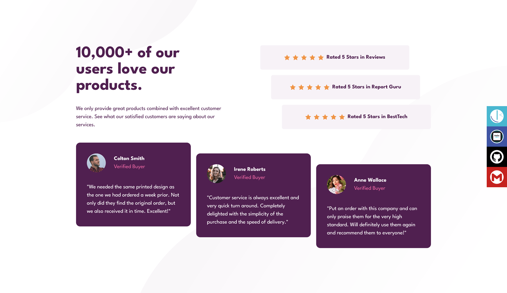
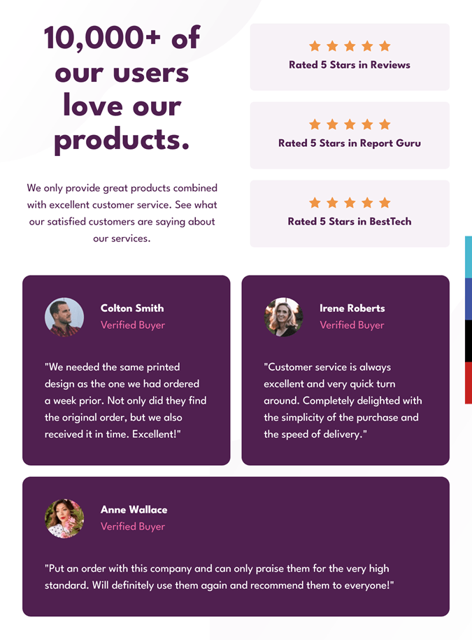
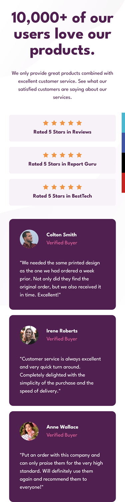

# Frontend Mentor - Social proof section solution

This is a solution to the [Social proof section challenge on Frontend Mentor](https://www.frontendmentor.io/challenges/social-proof-section-6e0qTv_bA). Frontend Mentor challenges help you improve your coding skills by building realistic projects. 

## Table of contents

- [Overview](#overview)
  - [The challenge](#the-challenge)
  - [Screenshot](#screenshot)
  - [Links](#links)
- [My process](#my-process)
  - [Built with](#built-with)
- [Author](#author)
- [Acknowledgments](#acknowledgments)

## Overview

### The challenge

Users should be able to:

- View the optimal layout for the section depending on their device's screen size

### Screenshot

#### Desktop

#### Tablet

#### Mobile

### Links

- Solution URL: [Github repository solution URL here](https://github.com/hadodev/SocialProofSection)
- Live Site URL: [Live site URL here](https://hadodev-frontendmentor-socialproof.netlify.app)

## My process

### Built with

- Semantic HTML5 markup
- CSS custom properties
- Flexbox
- CSS Grid
- Mobile-first workflow
- [tailwindcss](https://tailwindcss.com/) - A utility-first CSS framework packed with classes like flex, pt-4, text-center and rotate-90 that can be composed to build any design, directly in your markup.

## Author

- GitHub - [Hado Dev](https://github.com/hadodev)
- Frontend Mentor - [@hadodev](https://www.frontendmentor.io/profile/hadodev)

## Acknowledgments

For all authors who publish open source ressources and contents freely available and make Internet more awesome.